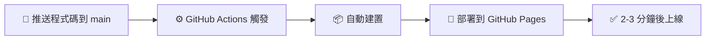

<div align="center">


# 匹克大師台灣 | Picklemaster Taiwan

### 台灣最完整的匹克球（Pickleball）學習平台

[](https://github.com/wutiger555/picklemaster-tw/actions/workflows/deploy.yml)
[](https://opensource.org/licenses/MIT)
[](https://react.dev/)
[](https://www.typescriptlang.org/)
[](https://vitejs.dev/)
[](https://picklemastertw.site/)

**🌐 線上體驗**：[https://picklemastertw.site/](https://picklemastertw.site/)

[功能特色](#核心功能) • [技術架構](#技術架構) • [快速開始](#本機開發) • [貢獻指南](#貢獻指南)

</div>

---

## 📊 快速概覽

<div align="center">

| 🗺️ 球場數量 | 📚 學習內容 | 🎮 互動功能 | ⚡ 技術棧 |
|:---:|:---:|:---:|:---:|
| **55+** | **30+** | **10+** | **React 19** |
| 全台球場 | 教學單元 | 互動元件 | TypeScript |

</div>

---

## 🎯 專案簡介

**匹克大師台灣（Picklemaster Taiwan）** 是專為台灣匹克球愛好者打造的一站式學習與資源平台。

<table>
<tr>
<td width="50%">

### ✨ 核心亮點

🗺️ **全台 55+ 球場地圖**
涵蓋台北、台中、高雄、台南等全台各縣市

📚 **互動式規則教學**
點擊式球場圖解，直觀學習場地規則

🎮 **3D 球場配置**
360° 檢視球場結構，深入了解站位

</td>
<td width="50%">

### 🚀 特色功能

🏸 **裝備選購指南**
球拍完全指南 + AI 智能推薦系統

📖 **系統化學習路徑**
從新手入門到進階技巧的完整路線

⚡ **互動式遊戲**
實作完整匹克球規則的網頁遊戲

</td>
</tr>
</table>

> 💡 無論你是剛接觸匹克球的新手，還是想精進技術的進階玩家，這裡都能找到你需要的資源！

---

## 🎨 核心功能

### 🗺️ 全台球場地圖
<details>
<summary>點擊展開詳細功能</summary>

- ✅ 超過 **55 個球場**資訊，持續更新中
- 🗺️ 互動式地圖標示球場位置
- 🔍 篩選功能：依地區、室內/室外、收費/免費分類
- 📍 球場詳細資訊：地址、開放時間、設施狀況
- 🧭 一鍵導航至球場

</details>

### 📚 規則教學
<details>
<summary>點擊展開詳細功能</summary>

- 🎯 **互動式球場**：點擊不同區域即時顯示規則說明
- 🎮 **3D 球場配置**：360° 旋轉檢視，學習站位與規則
- ⚡ **球路徑動畫**：視覺化展示發球、回球、雙跳規則

</details>

### 🏸 裝備指南
<details>
<summary>點擊展開詳細功能</summary>

- 📖 **球拍完全指南**：材質、重量、平衡點、握把尺寸完整解析
- 🏆 **職業選手裝備**：頂尖選手使用的球拍型號與規格
- 🤖 **AI 智能推薦系統**：根據技術程度、打法風格、預算推薦適合球拍

</details>

### 📖 學習路徑
<details>
<summary>點擊展開詳細功能</summary>

| 等級 | 內容 | 適合對象 |
|:---:|:---|:---|
| 🌱 **新手** | 基礎規則、握拍姿勢、發球技巧 | 完全初學者 |
| 🌿 **中階** | 網前技術、雙打配合、戰術應用 | 有基礎經驗者 |
| 🌳 **進階** | 高階技巧、比賽策略、心理素質 | 競賽級玩家 |

- 💾 **進度追蹤**：自動儲存學習進度（LocalStorage）

</details>

### 🎮 互動遊戲
<details>
<summary>點擊展開詳細功能</summary>

- 🎯 完整實作匹克球規則（發球、雙跳區、得分系統）
- 🎪 進階擊球控制（方向、力道、旋轉）
- ⚙️ 真實物理引擎模擬球的彈跳與運動
- 🎓 適合新手練習與熟悉規則

</details>

### 📱 資源中心
<details>
<summary>點擊展開詳細功能</summary>

- 🏛️ 台灣匹克球協會官方連結
- 🌍 國際匹克球組織資訊
- 🎥 線上教學影片整理
- 🏆 賽事資訊與活動公告

</details>

---

## 🛠️ 技術架構

<table>
<tr>
<td width="33%">

### ⚛️ 核心技術


</td>
<td width="33%">

### 🎨 UI 與動畫


</td>
<td width="33%">

### 🎮 3D 與地圖


</td>
</tr>
</table>

### 🚀 效能優化
- ⚡ **Vite 熱更新**：開發體驗極速流暢
- 📦 **代碼分割**：按需載入，減少初始載入時間
- 🎯 **Tree Shaking**：自動移除未使用的程式碼
- 💾 **LocalStorage**：學習進度本地儲存

### 📊 SEO 優化
- 🏷️ **結構化資料（JSON-LD）**：WebSite、Organization、Course、SportsActivityLocation
- 📄 **動態頁面標題**：每頁獨立 SEO 友善標題
- 🗺️ **Sitemap.xml**：完整頁面索引與更新頻率
- 📍 **地理位置標籤**：針對台灣本地搜尋優化
- 🔗 **Open Graph & Twitter Cards**：社群媒體分享優化

---

## 📁 專案結構

<details>
<summary>點擊展開完整結構</summary>

```
picklemaster-tw/
├── 📂 public/
│   ├── 📂 data/
│   │   └── courts.json         # 🗺️ 全台 55+ 球場資料
│   ├── logo.png                # 🎨 網站 Logo
│   ├── favicon.ico             # 🖼️ 網站圖示
│   ├── og-image.png            # 📸 社群分享預覽圖
│   └── sitemap.xml             # 🔍 搜尋引擎索引
├── 📂 src/
│   ├── 📂 components/
│   │   ├── layout/             # 🏗️ Header, Footer 佈局組件
│   │   ├── court/              # 🏟️ 互動式球場、球路徑動畫
│   │   ├── equipment/          # 🏸 裝備指南、AI 推薦系統
│   │   ├── learning/           # 📖 學習路徑、3D 球場
│   │   ├── map/                # 🗺️ 地圖組件
│   │   ├── game/               # 🎮 匹克球遊戲
│   │   ├── quiz/               # ❓ 互動測驗
│   │   └── hero/               # 🌟 首頁 Hero 組件
│   ├── 📂 pages/                # 📄 8 個主要頁面
│   │   ├── Home.tsx            # 🏠 首頁
│   │   ├── Rules.tsx           # 📚 規則教學
│   │   ├── Equipment.tsx       # 🏸 裝備指南
│   │   ├── LearningPaths.tsx   # 📖 學習路徑
│   │   ├── Courts.tsx          # 🗺️ 球場地圖
│   │   ├── Game.tsx            # 🎮 互動遊戲
│   │   ├── Resources.tsx       # 📱 資源中心
│   │   └── About.tsx           # ℹ️ 關於我們
│   ├── 📂 hooks/
│   │   └── usePageTitle.ts     # 🎯 動態頁面標題 Hook
│   ├── 📂 utils/
│   │   └── constants.ts        # 🔧 常數定義（路由、品牌資訊）
│   ├── 📂 types/
│   │   └── index.ts            # 📝 TypeScript 類型定義
│   └── 📂 styles/
│       └── index.css           # 🎨 全域樣式與 Tailwind 配置
├── 📂 docs/                     # 📦 建置輸出（GitHub Pages）
└── 📂 .github/
    └── workflows/
        └── deploy.yml           # 🚀 自動部署 CI/CD
```

</details>

---

## 💻 本機開發

### 📋 環境需求
-  **Node.js** 18 或以上版本
-  **npm** 或 **yarn** 套件管理工具

### 🚀 快速開始

```bash
# 1️⃣ 複製專案
git clone https://github.com/wutiger555/picklemaster-tw.git
cd picklemaster-tw

# 2️⃣ 安裝依賴套件
npm install

# 3️⃣ 啟動開發伺服器（支援熱更新）
npm run dev

# 4️⃣ 開啟瀏覽器訪問
# 🌐 http://localhost:5173
```

### ⚙️ 可用指令

| 指令 | 說明 | 圖示 |
|:---|:---|:---:|
| `npm run dev` | 啟動開發伺服器（Vite 熱更新） | ⚡ |
| `npm run build` | 建置生產版本至 docs/ 目錄 | 📦 |
| `npm run preview` | 預覽建置結果 | 👀 |
| `npm run lint` | 執行 ESLint 程式碼檢查 | 🔍 |

---

## 🚀 部署

### 🤖 GitHub Pages 自動部署

本專案使用 **GitHub Actions** 實現自動化部署：



### 🛠️ 手動部署

```bash
# 建置生產版本
npm run build

# 建置檔案會輸出到 docs/ 目錄
# 提交並推送到 GitHub
git add docs
git commit -m "Deploy: Update production build"
git push origin main
```

**🌐 正式網址**：[https://picklemastertw.site/](https://picklemastertw.site/)

**📦 GitHub Pages**：[https://wutiger555.github.io/picklemaster-tw/](https://wutiger555.github.io/picklemaster-tw/)

---

## 🔍 SEO 優化策略

為確保在台灣搜尋「匹克球」相關關鍵字時能獲得良好排名，我們實施了以下優化：

<table>
<tr>
<td width="50%">

### 🏷️ Meta Tags 優化
- 🌆 城市關鍵字：台北、台中、高雄匹克球
- 🎯 長尾關鍵字：新手教學、雙打、發球規則
- 📍 地理標籤：`geo.region: TW`

### 📊 結構化資料
- 🌐 **WebSite**：網站資訊與搜尋功能
- 🏢 **Organization**：品牌識別
- 🏟️ **SportsActivityLocation**：運動場地
- 📚 **Course**：學習課程內容

</td>
<td width="50%">

### 🗺️ Sitemap 與索引
- ✅ 完整的 `sitemap.xml` 涵蓋所有頁面
- 📅 首頁 `daily` 更新，核心頁面 `weekly`
- ⭐ 優先級：首頁 1.0，球場地圖 0.95

### 📄 動態頁面標題範例
- 🏠 首頁：「匹克大師台灣 - 台灣匹克球玩家社群」
- 🗺️ 球場地圖：「全台匹克球場地圖」
- 📖 規則教學：「匹克球規則教學」

</td>
</tr>
</table>

### 🚀 建議後續行動

| 行動 | 目的 | 優先級 |
|:---|:---|:---:|
| 📊 提交至 Google Search Console | 加快索引速度 | 🔴 高 |
| 🔗 建立反向連結 | 與協會、社群合作 | 🟡 中 |
| ✍️ 持續更新內容 | 定期新增球場、教學 | 🟢 持續 |

---

## 📊 資料來源

本平台的球場資訊與相關資料來源如下：

| 類型 | 來源 | 說明 |
|:---:|:---|:---|
| 🏟️ **球場資訊** | [中華民國匹克球協會](https://pickleball.org.tw) | 台灣各地球場位置與設施資訊 |
| 📖 **規則標準** | [USA Pickleball](https://usapickleball.org) | 國際標準匹克球規則 |
| 🗺️ **地圖資料** | [OpenStreetMap](https://www.openstreetmap.org) | 開放街圖地圖資料 |

> ℹ️ 所有資料僅供參考，實際球場資訊請以現場為準。

---

## 🤝 貢獻指南

歡迎對專案做出貢獻！無論是新增球場資訊、修正錯誤、優化功能，都非常歡迎。

### 📝 如何貢獻

```bash
# 1. Fork 本專案
# 2. 建立功能分支
git checkout -b feature/amazing-feature

# 3. 提交變更
git commit -m 'Add some amazing feature'

# 4. 推送分支
git push origin feature/amazing-feature

# 5. 開啟 Pull Request
```

### 🎯 貢獻類型

| 類型 | 說明 | 難度 |
|:---:|:---|:---:|
| 🏟️ **球場資訊** | 新增或更新球場資訊（`public/data/courts.json`） | ⭐ |
| 🐛 **Bug 修正** | 修正錯誤或優化使用者體驗 | ⭐⭐ |
| 📚 **教學內容** | 新增教學內容或資源連結 | ⭐⭐ |
| ⚡ **效能優化** | 改進 SEO 或效能 | ⭐⭐⭐ |
| 🌍 **在地化** | 翻譯或在地化內容 | ⭐⭐ |

---

## 📜 授權條款

本專案採用 **MIT License** 授權條款。

詳見 [LICENSE](LICENSE) 檔案。

---

## 📬 聯絡方式

<div align="center">

如有任何問題、建議或合作機會，歡迎透過以下方式聯絡：

[](https://github.com/wutiger555/picklemaster-tw/issues)
[](https://github.com/wutiger555)

</div>

---

## 📈 專案統計

<div align="center">


</div>

---

<div align="center">

### 🏸 為台灣匹克球社群而生

**Built with ⚛️ React + TypeScript + Vite**

Made with ❤️ in Taiwan 🇹🇼 | Version 1.0.0

**[⬆️ 回到頂部](#匹克大師台灣--picklemaster-taiwan)**

---

**© 2024 Picklemaster Taiwan. All Rights Reserved.**

</div>
